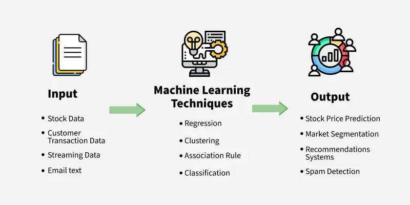
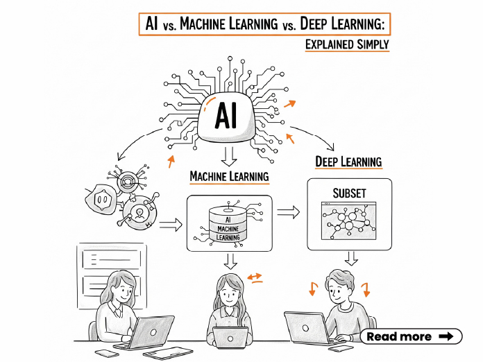
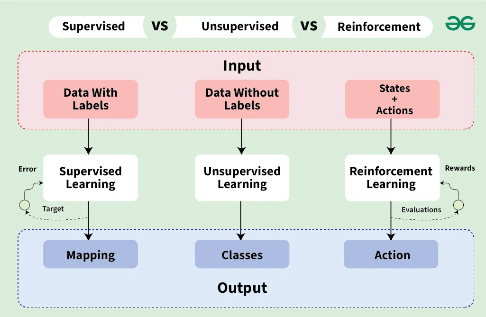

## Overview of Machine Learning

The beginning of machine learning can be traced back to the 1950s when Arthur Samuel, a pioneer in the field of artificial intelligence, developed a program that could play checkers and improve its performance over time through experience. Since then, machine learning has evolved significantly, with advancements in algorithms, computing power, and the availability of large datasets.

Machine learning mainly work on the performance of a specific task on computer system and the optimization of algorithms to improve that performance over time.The Machine Learning system use giant amount of data to learn and make predictions or decisions without being explicitly programmed for every possible scenario.


### Difference between AI, Machine Learning, and Deep Learning


- Artificial Intelligence (AI): AI is a broad field of computer science that focuses on creating systems capable of performing tasks that typically require human intelligence. This includes problem-solving, reasoning, learning, and understanding natural language. AI encompasses various techniques, including rule-based systems, expert systems, and machine learning.

- Machine Learning (ML): ML is a subset of AI that focuses on developing algorithms and statistical models that enable computers to learn from and make predictions or decisions based on data. Instead of being explicitly programmed for every task, ML systems improve their performance over time as they are exposed to more data. Common ML techniques include supervised learning, unsupervised learning, and reinforcement learning.

- Deep Learning (DL): DL is a specialized subset of ML that uses neural networks with many layers (deep networks) to analyze various factors of data. DL has gained popularity due to its success in tasks such as image and speech recognition, natural language processing, and game playing. It requires large amounts of data and significant computational power to train deep neural networks effectively.

### History of Machine Learning
- 1950-1970: **Alan Turing** proposed the concept of a machine that could simulate human intelligence. **Frank Rosenblatt** developed the Perceptron, an early neural network model. **Arthur Samuel** developed a checkers-playing program that improved through experience.
- 1970-1980: **Knowledge-based systems and expert systems gained popularity.** The backpropagation algorithm for training neural networks was introduced.
Expert systems are AI programs that mimic the decision-making abilities of a human expert in a specific domain. They use a set of rules and knowledge bases to provide solutions or recommendations based on input data. It is often a knowledge-driven approach, represented as "if-then" rules. **Decision trees** are introduced as a simple yet effective machine learning algorithm for classification and regression tasks. Besides, **Bayesian theorem** start to be used in machine learning for probabilistic inference and decision-making.
- 1980-2000: **Data driven and statistical methods became more prominent.** Decision trees are evolved into more advanced algorithms like C4.5. **Support Vector Machines (SVMs)** were introduced for classification tasks. **Unsupervised learning techniques like clustering and K-means** gained attention. Random forests and ensemble methods were developed to improve predictive performance.
- 2000-2020: **As the computing power increased and big data became more available, machine learning experienced significant growth.** Machine learning break the performance bottleneck of image, voice and text. [**DBN (Deep Belief Networks)**](https://www.cs.toronto.edu/~hinton/absps/fastnc.pdf) was introduced.
[**AlexNet**](https://dl.acm.org/doi/10.1145/3065386), a deep CNN, won the ImageNet competition in 2012, marking a significant milestone in deep learning. [**Generative Adversarial Networks (GANs)**](https://arxiv.org/abs/1406.2661) were introduced for generating realistic data. **AIGC**(Artificial Intelligence Generated Content) became a hot topic. **Reinforcement learning** gained attention with successes like AlphaGo defeating human champions in the game of Go. [**Transformers**](https://arxiv.org/abs/1706.03762) were introduced in 2017, revolutionizing natural language processing tasks.
- 2020-Present: Large language models (LLMs) like GPT-3, GPT-4 and BERT have demonstrated impressive capabilities in natural language understanding and generation. Multi-modal techniques have emerged, allowing models to process and generate content across different modalities (e.g., text, image, audio). CLIP from OpenAI and Gato from Google DeepMind has shown the potential of combining vision and language. Generalized machine learning techniques have emerged, including **Self-supervised learning**, which has gained traction, allowing models to learn from unlabeled data. This work significantly reduce the labor of labeling data. **Federated learning** has emerged as a way to train models across decentralized devices while preserving data privacy. **Explainable AI (XAI)** has become a focus to enhance transparency and interpretability of machine learning models.

### Machine Learning Applications
Machine learning has a wide range of applications across various industries and domains. Some common applications include:
- **Image and Speech Recognition**: Machine learning algorithms are used in facial recognition systems, voice assistants (e.g., Siri, Alexa), and image classification tasks.
- **Natural Language Processing (NLP)**: Machine learning is used in language translation, sentiment analysis, chatbots, and text generation.
- **Recommendation Systems**: Platforms like Netflix, Amazon, and Spotify use machine learning to recommend products, movies, or music based on user preferences and behavior.
- **Healthcare**: Machine learning is used for medical image analysis, disease diagnosis, drug discovery, and personalized treatment recommendations. It is also used in protein and virus structure design, such as AlphaFold from DeepMind.
- **Finance**: Machine learning is used for fraud detection, algorithmic trading, credit scoring, and risk assessment.

### Machine Learning Terminology
* **Dataset**: A collection of data used for training and evaluating machine learning models. It typically consists of input features and corresponding labels or target values.
    * **Training Set**: A subset of the dataset used to train a machine learning model. The model learns patterns and relationships from this data.
    * **Validation Set**: A subset of the dataset used to tune hyperparameters and evaluate the model's performance during training.
    * **Test Set**: A subset of the dataset used to assess the final performance of a trained machine learning model on unseen data.
* **Model**: A mathematical representation of a system or process that is trained to make predictions or decisions based on input data.
* **Sample**: An individual data point or instance in a dataset, consisting of input features and corresponding labels or target values.
* **Feature**: An individual measurable property or characteristic of the data used as input to a machine learning model.
* **Feature Vector**: A vector that represents the features of a sample in a dataset. It is typically a numerical representation of the input data.
* **Label**: The target variable or output that a machine learning model aims to predict or classify.
* **Training**: The process of feeding a machine learning model with labeled data to learn patterns and relationships.
* **Testing**: The process of evaluating a trained machine learning model on unseen data to assess its performance.
* **Overfitting**: A situation where a machine learning model performs well on the training data but poorly on unseen data, indicating that it has learned noise or irrelevant patterns.
* **Underfitting**: A situation where a machine learning model fails to capture the underlying patterns in the training data, resulting in poor performance on both training and unseen data.
* **Cross-validation**: A technique used to assess the performance of a machine learning model by dividing the dataset into multiple subsets and training/testing the model on different combinations of these subsets.
* **Hyperparameters**: Parameters that are set before training a machine learning model and control its learning process (e.g., learning rate, number of layers).
* **Parameters**: Internal variables of a machine learning model that are learned during the training process (e.g., weights in a neural network).
* **Loss Function**: A mathematical function that quantifies the difference between the predicted output of a machine learning model and the actual target values. The goal of training is to minimize the loss function.
* **Gradient Descent**: An optimization algorithm used to minimize the loss function by iteratively adjusting the model's parameters in the direction of the steepest descent of the loss function.
* **Epoch**: A complete pass through the entire training dataset during the training process.
* **Batch Size**: The number of training examples used in one iteration of training. It determines how many samples are processed before the model's parameters are updated.
* **Learning Rate**: A hyperparameter that controls the step size at which the model's parameters are updated during training. A too high learning rate can lead to divergence, while a too low learning rate can result in slow convergence.
* **Activation Function**: A mathematical function applied to the output of a neuron in a neural network to introduce non-linearity. Common activation functions include ReLU, sigmoid, and tanh.
* **Quantization**: The process of reducing the precision of the numbers used to represent a model's parameters, typically to decrease the model size and improve inference speed. Common quantization techniques include 8-bit integer quantization and 16-bit floating-point quantization.

<!-- ### Some Current Machine Learning Experts
- **Yann LeCun** Father of Convolutional Neural Networks (CNNs) and Deep Learning
- **Andrew Ng** Co-founder of Google Brain and Coursera
- **Geoffrey Hinton** Pioneer of Deep Learning and Neural Networks
- **Fei-Fei Li** Expert in Computer Vision and AI Ethics. Raise the ImageNet project
- **Ian Goodfellow** Inventor of Generative Adversarial Networks (GANs)
- **Pedro Domingos** Author of "The Master Algorithm"
- **Kaiming He** Co-inventor of ResNet -->

## Basic Rules of Machine Learning
### Basic Components of Machine Learning
```
Machine Learning = Model + Strategy + Algorithm
```
- **Model**: A mathematical representation of a system or process that is trained to make predictions or decisions based on input data.
- **Strategy**: The approach or method used to train and evaluate a machine learning model, such as supervised learning, unsupervised learning, or reinforcement learning.
- **Algorithm**: A set of rules or procedures used to solve a specific problem or perform a specific task, such as linear regression, decision trees, or neural networks.
Data is also a very important part of machine learning. But data is not a part of machine learning itself. Data is the input to machine learning. The quality and quantity of data can significantly impact the performance of a machine learning model.
### Classification of Machine Learning
Basically, machine learning can be classified into three main categories:

- **Supervised Learning**: The model is trained on **labeled data**, where the input features and corresponding labels are provided. The goal is to learn a **mapping** from inputs to outputs. Examples include regression and classification tasks. Similarity learning can be considered as a combination of regression and classification. Its target is to learn the similarity between two inputs. It use similarity function to measure the distance(similarity, relevance) between two inputs. It is widely used in recommendation systems, facial recognition, and information retrieval.
- **Unsupervised Learning**: The model is trained on **unlabeled data**, where only the input features are provided. The goal is to **discover patterns or structures** in the data. Examples include clustering and dimensionality reduction.
- **Half-supervised Learning**: The model is trained on a combination of **labeled** and **unlabeled data**. This approach can be useful when labeled data is scarce or expensive to obtain.
- **Reinforcement Learning**: The model learns to make decisions by interacting with **an environment and receiving feedback in the form of rewards or penalties.** The goal is to learn a policy that maximizes the cumulative reward over time.

We can also classify machine learning based on the type of model used, such as:
- **Linear Models**: These models make predictions based on a linear combination of input features. Examples include linear regression and logistic regression.
- **Probabilistic Models**: These models use probability theory to make predictions and quantify uncertainty. Examples include Bayesian networks and hidden Markov models.

### Modeling Process
Using supervised learning as an example, the modeling process typically involves the following steps:

1. **Data Collection**: Gather a dataset that includes input features and corresponding labels. This dataset will be used for training and evaluating the model.

2. **Data Preprocessing**: Clean and preprocess the data to ensure its quality. This may involve handling missing values, normalizing or scaling features, and encoding categorical variables.

3. **Feature Selection/Engineering**: Identify the most relevant features for the task at hand. This may involve creating new features from existing ones or selecting a subset of features to improve model performance.

4. **Model Selection**: Choose an appropriate machine learning algorithm or model architecture based on the problem type and data characteristics. This could involve trying out different algorithms and comparing their performance.

5. **Training**: Train the selected model on the training dataset by feeding it the input features and corresponding labels. The model learns to map inputs to outputs during this phase.

6. **Evaluation**: Assess the model's performance on a separate validation or test dataset. Common evaluation metrics include accuracy, precision, recall, F1-score, and area under the ROC curve (AUC-ROC).

7. **Hyperparameter Tuning**: Optimize the model's hyperparameters to improve performance. This may involve techniques like grid search or random search to find the best combination of hyperparameters.

8. **Deployment**: Once the model is trained and evaluated, it can be deployed to a production environment where it can make predictions on new, unseen data.

<pre>


</pre>
*From my point of view, we are trying to build the world by abstracting the real world into mathematical models. We use the vectors to represent the real world, and use the functions to represent the relationship between the vectors. Then based on theses vectors and functions, we can use some model to conclude the rules of the world. Then we can use these rules to predict the future or generate new things. In previous days, we need to explicitly define the rules of the world. But now, with the help of machine learning, we can let the computer learn the rules from the data. This is a big step forward in building the world. After decades of development, the machine learning model can describe the world in a black box way. We can use the model to predict the future or generate new things, but we don't know how the model works inside. This is a big challenge for us. We need to find a way to understand the model better, and make it more explainable. This is the future direction of machine learning.(Interpretable Machine Learning) As the parameters of the model are increasing exponentially, (billion to trillion level) the interpretability of the model is becoming more and more challenging and important.*