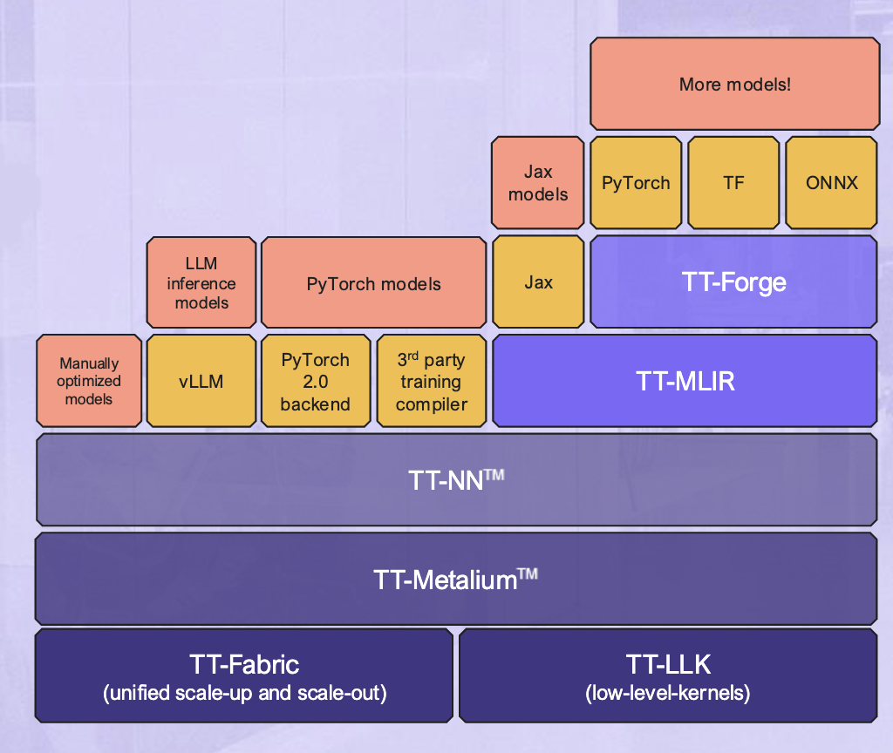
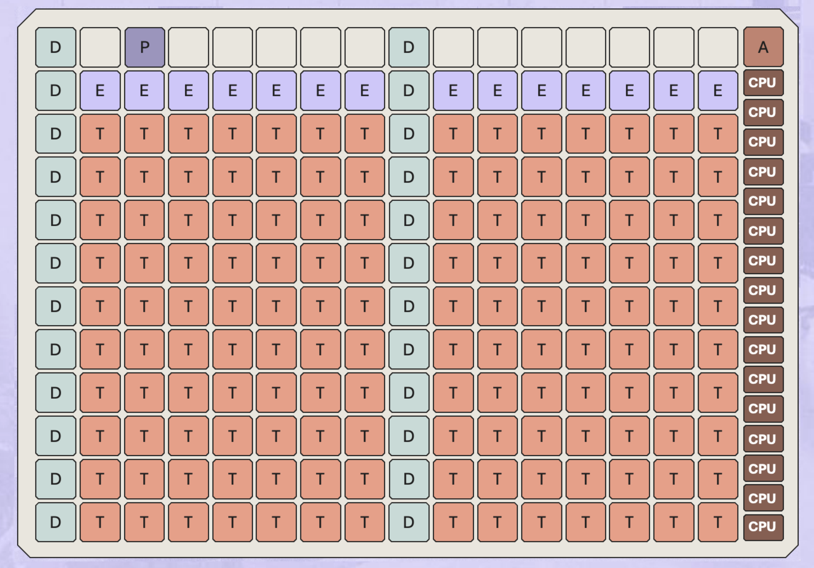

**Official Documentation:** 
[Tenstorrent Documentation](https://docs.tenstorrent.com/)

[Tenstorrent ISA Documentation](https://github.com/tenstorrent/tt-isa-documentation)

<!-- [Tenstorrent Metalium](https://docs.tenstorrent.com/tt-metal/latest/tt-metalium/index.html) -->

<!-- [Tenstorrent Metalium Examples](https://docs.tenstorrent.com/tt-metal/latest/tt-metalium/tt_metal/examples/index.html) -->

## Introduction to Tenstorrent

Tenstorrent is a Canadian AI hardware and software company that designs and manufactures high-performance processors for machine learning and artificial intelligence applications. Founded in 2016 by Ljubomir Perkovic, Tenstorrent aims to provide cutting-edge solutions for AI workloads, focusing on efficiency, scalability, and performance. Tenstorrent has multiple levels of software stack, including:
- [**TT-Metalium™**](https://docs.tenstorrent.com/tt-metal/latest/tt-metalium/index.html): The low-level, open-source software development kit (SDK) that provides developers direct access to Tenstorrent hardware. It is a bare-metal programming environment designed for users who must write custom C++ kernels for machine learning or other high-performance computing workloads.

- [**TT-Forge™**](https://docs.tenstorrent.com/forge/index.html): Tenstorrent’s Multi-Level Intermediate Representation (MLIR)-based compiler. It bridges high-level machine learning frameworks with the Tenstorrent software stack.
- [**TT-NN™**](https://docs.tenstorrent.com/tt-metal/latest/ttnn/index.html): A library of neural network operations that provides a user-friendly interface for running models on Tenstorrent hardware. It is designed to be intuitive for developers familiar with PyTorch.
- [**TT-Buda™**](https://docs.tenstorrent.com/pybuda/latest/index.html): Deprecated.

## Tenstorrent Hardware Overview

### Overview 

### Tensix Core

### Large RISC-V Core

### ARC Core

### DRAM Core

### Ethernet Core

### PCIE Core

## Tensix Core
- Baby RISC-V core
- Router
- Compute
- Buffer